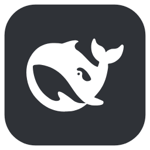
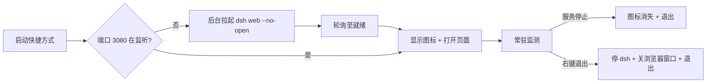

# DeepSeek Harness Web Launcher · 鲸鱼启动器

<p align="center">
  
</p>

<p align="center">
  <a href="https://github.com/XXXXXQ-0206/dsh-web-launcher/releases">
    
  </a>
  <a href="./LICENSE">
    
  </a>
  <a href="#">
    
  </a>
  <a href="#">
    
  </a>
</p>

给 **DeepSeek Harness Web**（`dsh web`）做的**极简一键启动器**，macOS + Windows 双平台。

> 核心约定：**托盘 / 菜单栏图标存在 ⇔ `dsh` 在后台运行。** 未运行则自动拉起 `dsh web`；就绪后在浏览器打开；服务停止后图标自动消失；右键仅「打开 / 退出」；退出会连同 `dsh` 一并停止，并关闭对应的浏览器窗口。

---

## 关于本仓库（About）

- **macOS 版**：菜单栏鲸鱼 + 程序坞常驻（Swift，见 [`sources/main.swift`](./sources/main.swift)），构建脚本 [`build.sh`](./build.sh)。
- **Windows 版**：纯系统托盘（WPF + 原生 Win32 托盘，与 [CquAutoLogin](https://github.com/XXXXXQ-0206/CquAutoLogin) 同款 DWM 沉浸式深色菜单），代码在 [`windows/`](./windows/)。
- 两者共享同一套行为约定与鲸鱼图标；Windows 版额外提供「退出时关闭 dsh 浏览器窗口」的清理逻辑。

仓库的描述、主题（Topics）与主页见右侧 **About** 面板（`Settings → General`，或 `gh repo edit`）。

## ✨ 功能

### 通用

- **自动启动**：`dsh` 未运行时自动执行 `dsh web --no-open`，就绪后打开浏览器。
- **状态即图标**：图标存在 = `dsh` 在后台；服务停止后图标随之消失。
- **单实例**：重复启动只唤醒已有实例，不会重复拉起 `dsh`。
- **令牌登录**：优先用启动日志里的 `http://127.0.0.1:3080/?token=...` 打开，无 cookie 也能登录。
- **退出清理**：退出时关闭标题为 `DeepSeek Harness` 的浏览器窗口（Windows 版）。

### macOS

- 菜单栏鲸鱼模板图（随深浅色自动反色）。
- 程序坞常驻；点击 Dock / 启动台图标即打开页面。
- 退出时自动关闭 Safari 中所有 dsh 标签；若 Safari 只剩 dsh 标签则连 Safari 一起退出。

### Windows

- 纯系统托盘图标（白色鲸鱼），无任务栏按钮、无控制台窗口。
- 右键仅「打开 DeepSeek Harness / 退出」，原生 Win32 菜单 + DWM 沉浸式深色模式。
- 用 `GetExtendedTcpTable` 瞬时探测端口，启动更快（启动器自身约 0.3s）。
- 退出会连同 dsh 进程一起停止，并关闭对应的 dsh 浏览器窗口。

## 🖼 界面

> 截图占位：欢迎在此放置 macOS 菜单栏 + Windows 托盘的实际截图。

macOS 菜单栏鲸鱼 · Windows 托盘 · 右键深色菜单

## ⚡ 快速开始

### macOS

**要求**：macOS 13+ (arm64)、Xcode 命令行工具（`swiftc`/`sips`/`iconutil`）、已安装 DeepSeek Harness（`dsh` 在 PATH 或 `~/.npm/_npx/.../bin/dsh`）。

```bash
./build.sh            # 构建到 dist/DeepSeek Harness.app
./build.sh install    # 构建并安装到 ~/Applications
```

### Windows

**要求**：Windows 10/11、.NET 9 Windows Desktop Runtime、已安装 DeepSeek Harness（`dsh` 在 PATH / `%APPDATA%\npm` / `%LOCALAPPDATA%\npm-cache\_npx\*\node_modules\.bin`）。

```powershell
cd windows
pwsh -NoProfile -ExecutionPolicy Bypass -File build.ps1            # 构建到 dist\DshWebLauncher.exe
pwsh -NoProfile -ExecutionPolicy Bypass -File create_shortcut.ps1  # 创建桌面「DeepSeek Harness」快捷方式
```

也可直接从 **Releases** 下载 Windows 预编译包。

## 🕹 使用

### macOS

- 点击图标（启动台 / Dock）→ 打开页面；服务未运行则先自动启动。
- 菜单栏鲸鱼 →「打开 DeepSeek Harness」「退出」。
- 日志：`~/Library/Logs/dsh-web-launcher.log`。

### Windows

- 双击桌面深灰底鲸鱼快捷方式 → 自动拉起 `dsh` 并打开页面。
- 右键托盘鲸鱼 →「打开 / 退出」（退出会停 `dsh` 并关闭 dsh 浏览器窗口）。
- 日志：`%LOCALAPPDATA%\DshWebLauncher\launcher.log`。
- 自检：`DshWebLauncher.exe --check`。

## ⚙️ 工作原理



更细的启动链路：

`单实例锁 → 探测 127.0.0.1:3080 → 未运行则拉起 dsh web --no-open → 短周期轮询至就绪（解析 token 地址）→ 打开浏览器 → 常驻监测：连续 2 次探测失败即退出。`

## 📁 目录结构

```text
.
├── sources/main.swift        # macOS 主程序
├── assets/                   # macOS SVG 图标（AppIcon / WhaleTemplate）
├── build.sh                  # macOS 构建脚本
├── Info.plist                # macOS 应用元信息
├── windows/                  # Windows 系统托盘版
│   ├── Program.cs            # 主程序（单实例/探测/拉起 dsh/退出清理）
│   ├── DshTrayIconService.cs # 原生 Win32 托盘 + 深色菜单
│   ├── DshWebLauncher.csproj # net9.0-windows WPF+WinForms
│   ├── build.ps1             # 构建
│   ├── create_shortcut.ps1   # 创建桌面快捷方式
│   ├── assets/               # 图标 SVG/PNG/ICO + make_icons.py
│   └── _test/                # 本地验证脚本（可删除）
└── README.md
```

## 🚀 Releases

前往 [Releases](https://github.com/XXXXXQ-0206/dsh-web-launcher/releases) 查看 / 下载各平台构建产物（含 Windows 预编译 `DshWebLauncher` 包）。

## 🎨 图标与致谢

`assets/AppIcon.svg`、`assets/WhaleTemplate.svg` 与 Windows 版 `windows/assets/*` 基于 DeepSeek 官方 favicon（取自 `@deepseek-ai/dsh-web-frontend`）重绘，仅作为本启动器视觉标识，版权归 DeepSeek 所有。

## 📄 许可证

见 [LICENSE](./LICENSE)。第三方图标版权归其原始持有者所有。
